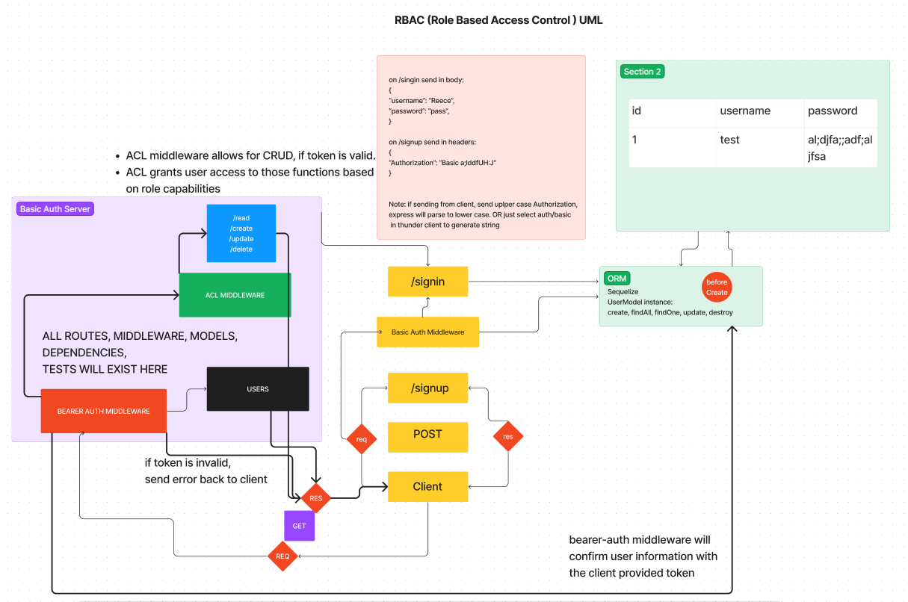

# LAB - Class 08

## Project: Access Control

### Author: Reece Renninger

### Problem Domain

Modularize the provided code into a single server instance

### Links and Resources

- [GitHub Actions ci/cd](https://github.com/ReeceRenninger/auth-api)
- [Back-end deployment](https://auth-api-lab08.onrender.com)

### Setup

#### `.env` requirements (where applicable)

    PORT=<your-port-choice>
    DATABASE_URL=postgres://localhost:5432/auth_api_lab08
    SECRET=<insert-secret-here>

#### How to initialize/run your application (where applicable)

- e.g. `npm start`

#### How to use your library (where applicable)

#### Features / Routes

- Routes could also use clothes or signin(post), signup(post), users(get), secret(get).
- Certain routes within v2 and user options will require basic or bearer auth.
- GET : `/api/v2/food` - get all food records
- GET : `/api/v2/food/:id` - get a specific food record
- POST : `/api/v2/food` - update a food record
- PUT : `/api/v2/food/:id` updated a food record by id
- PATCH : `/api/v2/food/:id` update a food record by id
- DELETE : `/api/v2/delete` delete a food record

#### Tests

- npm test will run all test suites
- v2 route tests bring in bearer and basic auth for testing

#### UML

